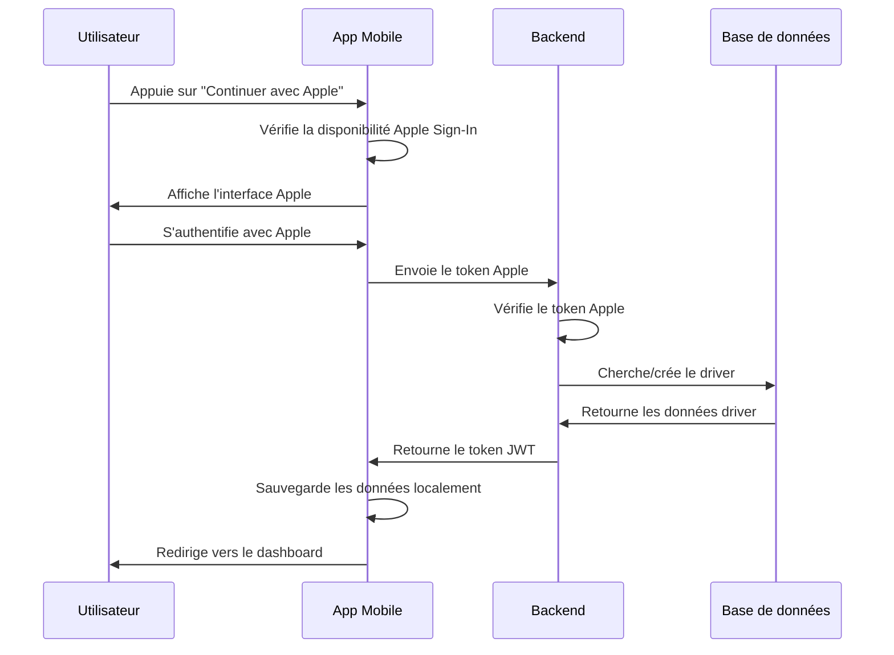

# Configuration Apple Sign-In pour Dar Darkom Driver

## 🍎 Vue d'ensemble

L'application mobile-driver utilise Apple Sign-In pour l'authentification des livreurs. Cette implémentation permet une connexion sécurisée et rapide sur iOS.

## 📋 Prérequis

### 1. Compte Apple Developer
- Compte Apple Developer actif
- App ID configuré avec Apple Sign-In activé
- Certificats de développement et de production

### 2. Configuration Apple Developer Console

#### App ID Configuration
1. Aller sur [Apple Developer Console](https://developer.apple.com/account/)
2. Sélectionner "Certificates, Identifiers & Profiles"
3. Créer ou modifier un App ID avec :
   - Bundle ID: `com.dardarkom.driver`
   - Apple Sign-In: ✅ Activé

#### Service ID Configuration
1. Créer un Service ID pour l'authentification web
2. Configurer les domaines autorisés
3. Activer Apple Sign-In

## 🔧 Configuration Backend

### Variables d'environnement
```env
# Apple Sign-In Configuration
APPLE_CLIENT_ID=com.dardarkom.driver
APPLE_TEAM_ID=your-team-id
APPLE_KEY_ID=your-key-id
APPLE_PRIVATE_KEY=your-private-key
```

### Endpoints disponibles
- `POST /api/auth/apple/driver` - Connexion Apple pour les drivers
- `POST /api/auth/apple` - Connexion Apple pour les utilisateurs

## 📱 Configuration Mobile

### 1. Dépendances installées
```json
{
  "expo-apple-authentication": "~8.0.7"
}
```

### 2. Configuration app.json
```json
{
  "ios": {
    "bundleIdentifier": "com.dardarkom.driver",
    "entitlements": {
      "com.apple.developer.applesignin": ["Default"]
    }
  },
  "plugins": ["expo-apple-authentication"]
}
```

## 🚀 Utilisation

### 1. Service Apple Auth
```typescript
import { appleAuthService } from '../services/appleAuthService';

// Vérifier la disponibilité
const isAvailable = appleAuthService.isAppleSignInAvailable();

// Connexion
const result = await appleAuthService.signInWithApple();
```

### 2. Hook d'authentification
```typescript
import { useDriverAuth } from '../hooks/useDriverAuth';

const { user, loginWithApple, logout, isAuthenticated } = useDriverAuth();
```

## 🧪 Tests

### 1. Test sur simulateur iOS
```bash
# Démarrer l'application
npm run ios

# Tester la connexion Apple
# 1. Appuyer sur "Continuer avec Apple"
# 2. Utiliser les identifiants de test Apple
# 3. Vérifier la création du driver dans la base de données
```

### 2. Test sur appareil physique
```bash
# Build et installation
eas build --profile development --platform ios

# Tester avec un vrai compte Apple
```

### 3. Vérification backend
```bash
# Vérifier les logs
tail -f logs/app.log | grep "Apple Driver"

# Vérifier la base de données
# Le driver doit être créé avec role: 'driver'
```

## 🔍 Dépannage

### Erreurs courantes

#### 1. "Apple Sign-In n'est pas disponible"
- Vérifier que l'appareil est iOS
- Vérifier la configuration des entitlements
- Redémarrer l'application

#### 2. "Token Apple invalide"
- Vérifier la configuration du Service ID
- Vérifier les certificats Apple
- Vérifier les variables d'environnement

#### 3. "Erreur de communication avec le serveur"
- Vérifier la connectivité réseau
- Vérifier que le backend est démarré
- Vérifier l'URL de l'API

### Logs utiles
```bash
# Logs mobile
npx react-native log-ios

# Logs backend
console.log('🍎 Apple Driver Sign In - Données reçues:', data);
```

## 📊 Flux d'authentification



## 🛡️ Sécurité

### 1. Validation des tokens
- Vérification de la signature Apple
- Validation de l'expiration
- Vérification de l'audience

### 2. Gestion des données
- Chiffrement des tokens locaux
- Nettoyage des données sensibles
- Rotation des tokens

### 3. Gestion des erreurs
- Messages d'erreur génériques
- Logs détaillés côté serveur
- Fallback en cas d'échec

## 📈 Monitoring

### Métriques importantes
- Taux de succès de connexion Apple
- Temps de réponse de l'authentification
- Erreurs par type

### Alertes
- Échecs de validation des tokens
- Erreurs de création de driver
- Problèmes de connectivité

## 🔄 Mise à jour

### Version des dépendances
```bash
# Mettre à jour expo-apple-authentication
npx expo install expo-apple-authentication@latest

# Mettre à jour apple-signin-auth
npm update apple-signin-auth
```

### Migration des données
- Les drivers existants conservent leurs données
- Les nouveaux drivers utilisent Apple Sign-In
- Compatibilité avec l'authentification par téléphone

## 📞 Support

### Ressources
- [Documentation Apple Sign-In](https://developer.apple.com/sign-in-with-apple/)
- [Documentation Expo Apple Auth](https://docs.expo.dev/versions/latest/sdk/apple-authentication/)
- [Guide Apple Developer](https://developer.apple.com/documentation/sign_in_with_apple)

### Contact
- Email: support@dar-darkom.com
- Slack: #mobile-driver-support
- GitHub: Issues du projet

